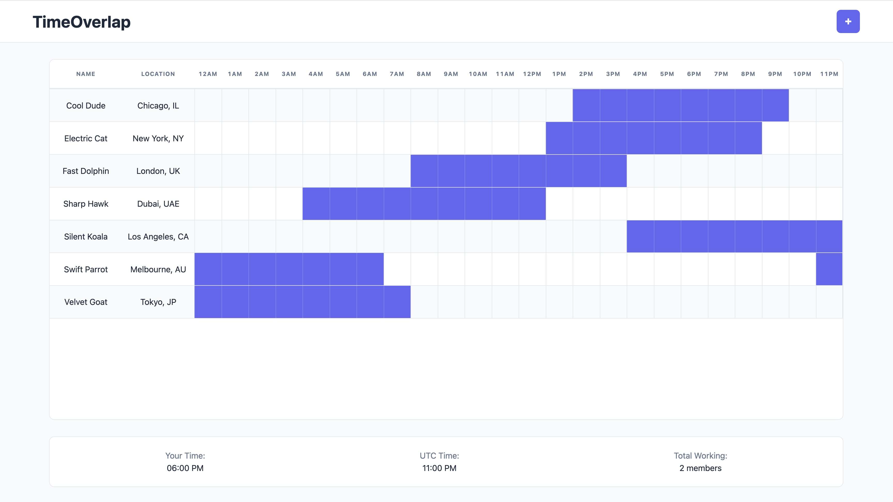
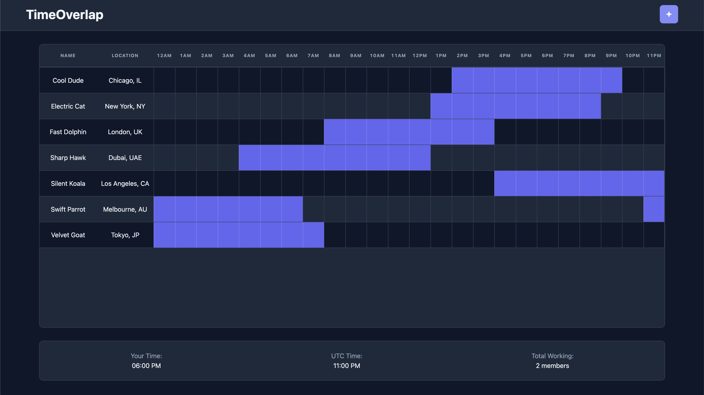

# TimeOverlap
**A zero-dependency, highly performant timezone visualization tool for globally distributed teams.**

## Visual Demonstration
| Light Mode |
| :-- | 
| |
| Dark Mode |
| :-- | 
| |

## Overview
TimeOverlap is a lightweight, frontend-only web application that visualizes global team availability on a unified 24-hour UTC grid. By inputting your team's local timezones and working hours, the application maps active periods. This makes it easy to pinpoint the perfect overlapping window for collaborations. 

## Key Features
* **Dynamic Timezone Normalization:** automatically converts standard IANA timezone strings into accurate UTC offsets. 
* **Visual Work-Hour Mapping:** plots each team member on a unified 24-hour grid, highlighting their active working blocks. 
* **Overnight Shift Handling:** accurately renders "wrap-around" shifts without breaking the linear UI. 
* **Real-Time Active Tracking:** Features a status dashboard that displays the current local time, UTC time, and dynammically counts how many team members are currently active. 

## Technical Architecture & Decisions

### 1. Performant DOM Manipulation
Re-rendering large grids can be computationally expensive. To ensure performance:
* **`DocumentFragment`:** grid rows are constructed entirely in memory using `document.createDocumentFragment()` and appended to the live DOM in a single operation, drastically reducing layout thrashing and repaints.
* **`replaceChildren()`:** used over `innerHTML = ''` to safely and quickly clear previous grid states without risking memory leaks from detached event listeners.

### 2. Object-Oriented Design (OOP)
The application utilizes ES6 Classes (`MemberProfile`) to encapsulate member data and logic.
* **DRY Principles:** the core business logic for determining if a user is currently working (`isWorkingAtHour()`) is housed directly inside the class. This allows both the UI grid renderer and the status interval timer to share the exact same logic, preventing code duplication.

### 3. Native Intl API
The app leverages the browser's native `Intl.DateTimeFormat` API to calculate offsets.

## 🚀 How to Use This

1. Clone the repository. 
2. Open `index.html` in any modern web browser. 